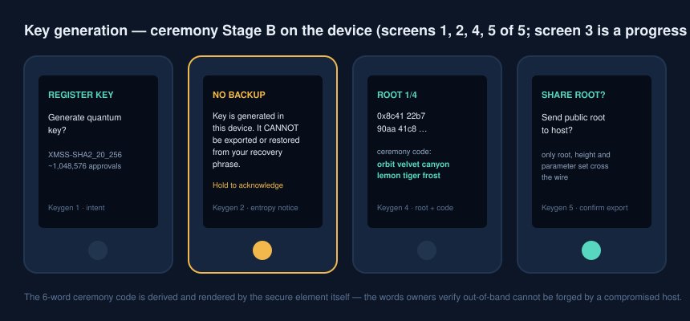
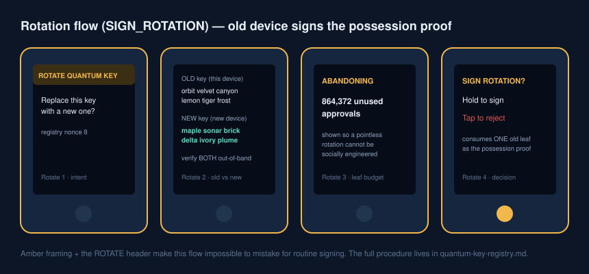
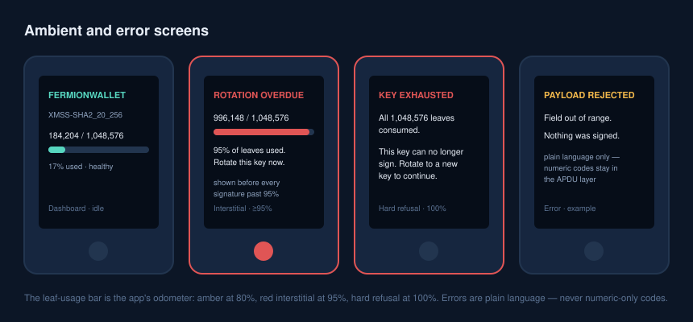

# Ledger XMSS App — Device UI Reference

Screen-by-screen visual reference for the FermionWallet Ledger app. The normative behavior lives in [`ledger-xmss-app.md`](./ledger-xmss-app.md) ("Device UI specification"); this document is the illustrated companion — what the Administrator actually sees, in order, for every flow. Mockups show the Nano-class (BAGL) layout; Stax/Flex (NBGL) renders the same fields as touch pages with identical content and ordering.

The framing convention carries meaning and is enforced by firmware, not styling choice:

| Frame color | Flow | Mistakable for signing? |
|---|---|---|
| Teal | Sign approval | — |
| **Red** | Deny | No — distinct header + frame on every screen |
| **Amber** | Rotate key / warnings | No — distinct header + frame on every screen |

## Signing flow (`SIGN_PREAPPROVAL`) — 8 screens

No signature exists until all eight screens are traversed and the decision screen is held. There is no skip, no summary-only mode, no raw-hash path.

1. **Header** — flow name, leaf index, and remaining budget in one glance. A leaf number that jumped since last time is the odometer telling you the host tried to burn leaves.
2. **Token** — symbol when the contract matches the built-in/CAL list; otherwise `Unknown token` plus the full contract address, chunked.
3. **Amount** — decimals-adjusted with symbol; the raw `uint256` is one page deeper.
4. **Recipient** — full address across pages, never truncated. Compare against the value you verified out-of-band, not against the host screen alone.

5. **Validity** — absolute UTC start/end, never durations.
6. **Context** — Safe address (chunked), chain name/ID, Safe nonce.
7. **Policy hash** — first/last 8 hex; compare against the hash shown in the app.
8. **Decision** — hold to approve (counter commits in SE NVRAM *before* the signature streams out), single tap to reject. 60 s idle = reject; reject/timeout consumes no leaf.

**PAYLOAD/ADMIN classes** reuse this flow with screens 2–4 replaced by target address, native value, and payload `dataHash`; ADMIN additionally shows the `ADMIN ACTION — affects Safe governance` warning header. A **batch** shows `BATCH — n legs`, per-token totals (informational), and the binding batch `dataHash` — legs are reviewed in the app, the hash is verified on the device.

## Denial flow — red frames, zero leaf cost

Denying produces a Ledger-signed refusal that is as auditable as an approval but touches no XMSS state: the signature is plain ECDSA over the denial record (payload hash + reason hash), the leaf counter never moves, and the final screen states the unchanged counter explicitly. The reason is entered in the app (required, free text + quick-picks) before the device flow starts; the device displays it so you sign what the audit log will say.

## Key generation (`GET_XMSS_ROOT`) — ceremony Stage B

Five screens: intent (parameter set + lifetime), the amber **NO BACKUP** acknowledgment (the key is intentionally not derivable from the recovery phrase — restoring a seed would reset the leaf counter and enable reuse forgery), tree-construction progress (not shown; cancellable until complete), root review with the **6-word ceremony code rendered by the secure element**, and export confirmation (only root, height, parameter set leave the device). Re-running the command after generation replays screens 4–5 only.

## Rotation (`SIGN_ROTATION`) — amber frames

Run on the **old** device as the possession proof of the [rotation procedure](./quantum-key-registry.md). The device shows old vs. new ceremony words (verify both out-of-band), the number of approvals being abandoned (so a pointless rotation can't be socially engineered invisibly), and a decision screen that names its cost: one old-key leaf.

## Ambient and error screens

- **Dashboard (idle):** parameter set + leaf-usage bar. Amber at ≥80%, red at ≥95%.
- **Rotation-overdue interstitial:** prepended to every signing flow at ≥95% usage.
- **Key exhausted:** at 100% the app refuses to sign — rotation instructions are the only content.
- **Errors:** every failure is a distinct plain-language screen (`Payload rejected — field out of range`, `Session already active`, `Key exhausted — rotate`, `Clock window invalid`). Numeric codes exist only at the APDU layer.

## Acceptance criteria

The `ragger` snapshot suite pins every screen above on both BAGL and NBGL targets; the full checklist is in [`ledger-xmss-app.md`](./ledger-xmss-app.md) ("Device UI acceptance criteria"). Headline invariants: no signature without full-field traversal, reject/timeout never consumes a leaf, addresses and root never truncated, rotation visually impossible to mistake for signing.
