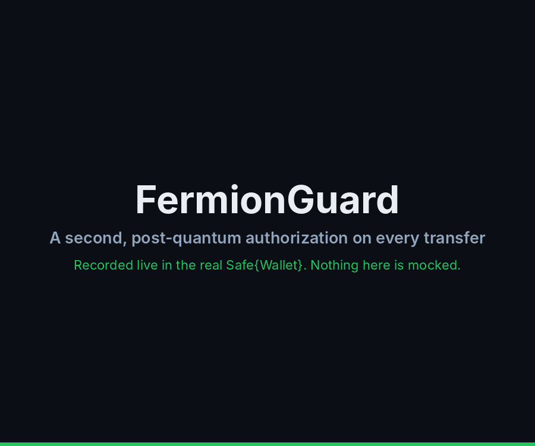

# FermionGuard

<p align="center">
  
</p>

**The quantum-ready second authorization layer for institutional digital-asset custody.**

<p align="center"><a href="https://skalenetwork.github.io/fermionwallet/"><b>🌐 skalenetwork.github.io/fermionwallet</b></a> — product site</p>

<p align="center">
  <a href="./demo/wallet/README.md"></a>
</p>

<p align="center"><i>Not a mockup: a real Safe in the <b>real Safe{Wallet}</b>, on a real chain, with the Guard enforcing on-chain. An owner signs a 250,000 dUSD transfer — and it still will not execute. The Quantum Administrator reads every field on the device and approves it with a one-time post-quantum signature. Only then does the money move.<br/>The device is the <b>simulated</b> Ledger: the hardware app is specified, not built yet. Recorded end to end against the local stack by <a href="./demo/wallet/e2e/record.js"><code>demo/wallet/e2e/record.js</code></a>, which asserts the transfer pays nothing before the approval and exactly 250,000 dUSD after it.</i></p>

> **Official Safe App URL:** `https://skalenetwork.github.io/fermionwallet/app/`
>
> Add it in Safe{Wallet} under *Apps → My custom apps → Add custom Safe App*. Only ever copy this URL from this README — never from an email, chat message or search result. The app is a preview: it shows your Safe's FermionGuard readiness (Guard and fallback-handler status); approvals and the key ceremony are not live yet, and the contracts are not audited.
>
> **Try it locally:** each release ships a demo container: a local chain with a real Safe, the FermionGuard and a simulated Ledger, plus a web UI. Run `docker run --rm -p 8080:8080 -p 8545:8545 ghcr.io/skalenetwork/fermionguard-demo:latest` and open http://localhost:8080.
>
> **Try it in the real Safe{Wallet}:** `cd demo/wallet && docker compose up -d --wait`, then open http://localhost:8000. This runs the open-source Safe{Wallet} stack locally with FermionGuard as a Safe App. You try to pay from the Safe and Safe{Wallet} can't execute it; you approve the payment on the simulated Ledger and it goes through. See [demo/wallet](./demo/wallet/README.md). Both commands pull images that are published with the first release that includes them. Until then, build from a source checkout: `docker build -f demo/Dockerfile -t fermionguard-demo .` in the repository root, then `docker run --rm -p 8080:8080 -p 8545:8545 fermionguard-demo`; for Safe{Wallet}, use the build command in [demo/wallet](./demo/wallet/README.md#run-it).

Banks, qualified custodians, and enterprise treasuries already run the gold-standard stack: Gnosis Safe, policy engines, hardware keys, and regulated operations. FermionGuard does not replace that stack. It **hardens it** — adding a cryptographically independent second gate that sits in the execution path of every high-value transfer.

If a signer is compromised, a policy is misconfigured, or classical signatures eventually fall to quantum computers, the transfer still does not move. Not until a separate, domain-bound, post-quantum authorization says yes.

That is the product: **keep the wallets you already trust. Make the next decade of cryptographic risk irrelevant.**

## About the author

**Stan (Konstantin) Kladko** — the rare builder who has worked on both sides of the quantum threat: the physics that creates it and the cryptography that must survive it.

- **Quantum physicist by training** — Ph.D. from the Max Planck Institute, M.S. from Kharkov University; Otto Hahn Research Fellow at Stanford University, where he worked with Nobel laureate Robert B. Laughlin on strongly correlated quantum systems; Director's Fellow in the Theoretical Division at Los Alamos National Laboratory, conducting national-security research in quantum materials.
- **Production cryptographer by trade** — Core Cryptography Lead at Ingrian Networks (enterprise data-privacy infrastructure later absorbed into SafeNet/Thales HSM lineage) and core computer-science team member at Sun Microsystems.
- **Ran the lab that certifies the world's crypto** — Director of Aspect Labs / BKP Security, a Silicon Valley cryptographic-module testing laboratory operating under NIST's Cryptographic Module Validation Program (CMVP), delivering FIPS 140-2 validations, Common Criteria evaluations, and FISMA assessments for government-grade cryptography. His lab work included side-channel security — presenting SPA/DPA (power-analysis) testing methodology to the NIST community. He hasn't just built secure cryptography; he has been the examiner that governments trust to certify it.
- **Proven at blockchain scale** — Co-founder and CTO of SKALE, an Ethereum-aligned blockchain network securing real value in production with BLS threshold cryptography his team took from paper to mainnet.
- **Serial infrastructure founder** — previously co-founded Galactic Exchange (big-data container clusters) and Cloudessa (cloud network-access security).

Few people on earth have run quantum-materials research at a national lab, directed a NIST-accredited cryptographic validation laboratory, shipped enterprise-grade cryptography, and operated a live blockchain network. That intersection is exactly what post-quantum custody requires — and it is why institutions evaluating their PQ migration path start the conversation with Stan.

FermionGuard is his answer to the question every custody board is now asking: *what protects the vault the day classical signatures stop being enough?*

---

## Why this exists

Institutional custody is already excellent at *who* can sign. It is not yet excellent at *what happens when those signatures are no longer enough*.

- Multisig is governance. It is not a quantum hedge.
- Hardware isolation is operational security. It is not a second cryptographic domain.
- Off-chain policy is useful. It is not an on-chain veto.

FermionGuard closes that gap. It installs as a **Safe Guard** — the official Gnosis Safe pre-execution hook — and refuses any ERC-20 movement that lacks a matching, time-bound, nonce-protected, quantum-signed pre-approval.

Owners still sign. Governance still governs. The Guard is the last word.

---

## The 2-of-2 model institutions actually need

| Layer | What it is | Who it protects against |
|---|---|---|
| **First authorization** | Existing Safe owners, thresholds, and treasury workflow | Rogue operators, lost devices, internal process failure |
| **Second authorization** | FermionGuard quantum key + policy-bound pre-approval, enforced on-chain | Compromised signers, replay, allowance drains, future quantum attacks on classical keys |

Two independent cryptographic domains. One execution path. Zero silent bypasses.

This is the control model regulated custodians already describe to examiners — dual control, independent verification, fail-closed enforcement — expressed as a smart-contract primitive rather than a slide in a SOC 2 appendix.

---

## Built for the desks that move real AUM

FermionGuard is designed for teams that cannot afford a “move fast and hope” wallet:

- **Qualified custodians and digital-asset banks** that must prove dual control to regulators, not just to themselves
- **Corporate and protocol treasuries** sitting on Safe vaults that already hold eight- and nine-figure balances
- **Asset managers and funds** that need policy-bound transfers, immutable audit trails, and a credible post-quantum roadmap
- **Prime brokers and settlement platforms** that want a drop-in enforcement layer without ripping out Safe, HSM, or existing ops tooling

If your mandate is *client assets, bank-grade controls, and a 10-year cryptographic horizon*, this is the add-on that belongs in the architecture review.

---

## What investors are looking at

**Category.** Post-quantum security for on-chain institutional custody — not a new wallet, not a new chain, not another consumer seed-phrase app.

**Wedge.** The Gnosis Safe Guard is a standard, audited integration point already in production at the institutions that matter. FermionGuard rides that rail. Sales cycle starts with “install a Guard,” not “migrate the vault.”

**Moat.**
- On-chain enforcement, not a backend promise
- Domain-separated, chain-bound, single-use quantum authorizations
- Policy as a hard cap (token, amount, recipient, expiry) — never a suggestion
- Explicit denial of the classic drain paths: `approve`, `permit`, `transferFrom`, `delegatecall`, module bypass, refund abuse, guard removal

**Why now.** NIST has standardized post-quantum signatures. Institutional boards are asking about cryptographic agility. The wallets that hold the assets have not yet answered. FermionGuard is that answer, shipped as an add-on rather than a rip-and-replace.

**Why this shape of product.** We did not invent a fake “contract signer.” We implemented the real Safe execution model: `ITransactionGuard.checkTransaction` as a veto, `setGuard` as the install path, and a hardening program that treats module bypass, nonce quirks, reentrancy, and refund drains as first-class threats.

---

## Product, in one sentence

A Safe Guard that will not let the vault move a token unless a quantum-safe second key has already authorized *that exact* transfer, on *that* chain, to *that* recipient, for *that* amount, once.

---

## Architecture at a glance

```text
Treasury / Ops / Custody UI
            |
            v
FermionGuard Add-on Service
  - generate PQ / hybrid keys
  - create time-bound pre-approvals
  - bind policyHash + chain + Safe
            |
            v
Quantum Key Registry          Pre-approval Engine
  - public-key metadata         - nonce, expiry, revoke
  - rotation / status           - single-use consumption
            |
            v
        Safe Guard  <—— last on-chain veto
            |
            v
     Gnosis Safe Wallet
  - existing owners & threshold
  - executes only if Guard returns
```

Full design: [`fermionguardspec.md`](./fermionguardspec.md)

Not running a Safe? [`fermionwallet.md`](./fermionwallet.md) specifies **FermionWallet**, a second product: the smallest possible standalone contract that holds ERC-20 tokens and releases them only against the same Ledger's hybrid signature — no owners, no governance, and no recovery.

---

## Security posture (what we refuse to hand-wave)

- Real post-quantum or hybrid signatures — HMAC demos are not production claims
- **A machine-checked XMSS verifier — and we say exactly how far the proof reaches.** In the on-chain XMSS verifier ([skalenetwork/xmss-solidity](https://github.com/skalenetwork/xmss-solidity)), every RFC 8391 primitive (`chain`, `randHash`, the base-w message encoding, `ltree`, the tree climb, `hMsg`) and every path on which `verify` *rejects* are proven equal, for all inputs, to a line-by-line transcription of RFC 8391's verification algorithms, by symbolic execution with Halmos. The composition of those primitives into an *accepting* `verify` is argued by hand, machine-checked symbolically only at tree height 2, and pinned by concrete RFC 8391 vectors at h = 4, 10 and 20 — not machine-checked for general h. See its [`PROOF.md`](https://github.com/skalenetwork/xmss-solidity/blob/main/PROOF.md) for what is proven and assumed
- Exact calldata matching, not “a pre-approval ID exists”
- Chain ID + Safe address + nonce + policyHash domain separation
- Transaction-guard *and* module-guard coverage so `execTransactionFromModule` cannot walk around the gate
- Fail-closed pause, time-locked unpause, time-locked emergency de-guard (so a bug cannot brick client funds)
- Non-upgradeable Guard; new code ships as a new Guard set by Safe governance
- Selector allowlist: `transfer` only by default; each Safe can add other selectors only through a timelocked admin approval, and `approve`, `increaseAllowance`, `permit` and `transferFrom` can never be allowed

Details live in [`fermionguard-module.md`](./fermionguard-module.md).

---

## Status

The Solidity contracts are implemented and tested: the `FermionGuard` (transaction guard and module guard, built on the official Safe `ITransactionGuard` / `IModuleGuard` interfaces) with its Quantum Key Registry, Pre-approval Engine and XMSS verifier. The XMSS verifier's primitives and reject paths are proven equal to RFC 8391's verification algorithms with Halmos — its accept path is composed by a hand argument and pinned by vectors at h = 4, 10 and 20, not machine-checked for general h — and the key registry's state machine is proven equivalent to an executable specification with Halmos (`contracts/test/registry-proof/`, with authorization and signature verification abstracted). Beyond those, the Guard, registry and engine are covered by unit, integration, fuzz and invariant tests but not formally verified. They are not audited and not deployed on any public network. A first Rust Ledger app exists in `ledger-app/` and the demo can drive it in Ledger's Speculos emulator, but it is a subset of [`ledger-xmss-app.md`](./ledger-xmss-app.md) — one key slot, a demo tree height of 4, no key-generation or rotation commands, Nano screens only, and a recovery-phrase-derived XMSS seed that the hardware security policy forbids — so it must not hold real funds; `ledger-app/README.md` lists every gap, and the default demo still uses the simulated Ledger. The repository also keeps an early JavaScript prototype of the key, policy, and pre-approval flows (below).

This is early. The category is not.

---

## Prototype

An early JavaScript model of the key, policy and pre-approval flow (`src/`). It is not the enforcement layer and it is not post-quantum: its "quantum key" signs with an **HMAC-SHA256 demo MAC** (`algorithm: 'hmac-sha256-demo'`, `postQuantum: false`), a symmetric secret where whoever can verify can also forge. The real rules are enforced on-chain by `contracts/src/PreApprovalEngine.sol` with hybrid ECDSA + XMSS signatures.

It mirrors the contract's TRANSFER-class rules: the transfer must go to the signed `recipient`, for exactly the signed `amount` of the signed token, once; nonces are unique per wallet; the window must be at least 15 minutes (`MIN_WINDOW_MS`), end in the future, and is inclusive at both ends; one active key per wallet, and approvals made under a rotated key stay executable. It does not model: the Safe address and chain id, EIP-712 digests, XMSS leaf consumption, PAYLOAD/ADMIN classes, Tier-1 `safeTxHash` pins, key revocation, or the selector allowlist. Its clock is in milliseconds (`Date.now()`); the contract's is `block.timestamp` seconds.

```js
import { ERC20Token, FermionGuard, MIN_WINDOW_MS } from './src/index.js';

const token = new ERC20Token('Fermion', 'FERM');
const wallet = new FermionGuard('0xOwner');

token.mint('0xOwner', 1000n);
const quantumKey = wallet.generateQuantumKeyPair();

const approval = wallet.createPreApproval({
  token,
  recipient: '0xVault',
  amount: 200n,
  validFrom: Date.now() - 1000,
  validTo: Date.now() + MIN_WINDOW_MS,
  nonce: 'n-1',
  quantumKeyId: quantumKey.quantumKeyId,
  policyHash: 'treasury-policy-v1'
});

console.log(wallet.validatePreApproval(approval.preApprovalId));
console.log(wallet.executePreApprovedTransfer(approval.preApprovalId, '0xVault', 200n));
```

```bash
npm test
```

---

## For operators, risk, and investment committees

If you already custody on Safe, FermionGuard is the smallest possible change with the largest possible security delta: one Guard, one second key domain, one on-chain veto.

If you are allocating to the infrastructure that will still be standing when classical signatures are a footnote, this is the layer to underwrite.

---

**Keep the vault. Add the future.**
