# FermionWallet UI Help

A user guide to the FermionWallet Safe App for the three roles that use it: **Safe owners**, the **Quantum Administrator**, and **treasury operators**. Screens shown are design mockups from the UI specification in [fermionwallet-add-on-service.md](./fermionwallet-add-on-service.md).

## Contents

- [What you're looking at](#what-youre-looking-at)
- [Adding the Guard to an existing Safe](#adding-the-guard-to-an-existing-safe)
- [Reading the transaction queue](#reading-the-transaction-queue)
- [When an approved transaction is replaced](#when-an-approved-transaction-is-replaced)
- [Approving a transfer (Quantum Administrator)](#approving-a-transfer-quantum-administrator)
- [Approving a batch (MultiSend)](#approving-a-batch-multisend)
- [Denying a transfer](#denying-a-transfer)
- [The key ceremony (first-time setup and rotation)](#the-key-ceremony-first-time-setup-and-rotation)
- [Administrative approvals and the timelock](#administrative-approvals-and-the-timelock)
- [Emergency Guard removal (owners only)](#emergency-guard-removal-owners-only)
- [What you see on the Ledger](#what-you-see-on-the-ledger)
- [Key health](#key-health)
- [Audit log and export](#audit-log-and-export)
- [Troubleshooting](#troubleshooting)

## What you're looking at

FermionWallet runs as a **Safe App** — an app inside your existing Safe{Wallet} interface. It adds a second, quantum-resistant authorization to your Safe: transactions still need your normal owner signatures, *and* a quantum pre-approval signed by the Quantum Administrator's hardware key. Nothing about your Safe changes; the app is where you see and manage the quantum half.

## Adding the Guard to an existing Safe

You do not migrate anything. Your Safe, owners, threshold, and history stay exactly as they are — you install a **Guard**, a standard Safe feature that vets every transaction before it executes. The app walks you through four steps; budget ~30 minutes with your owners reachable.

**Before you start, the app runs a preflight and will refuse to continue if any check fails:**

| Check | Why |
|---|---|
| Safe version 1.3.0+ | Guards don't exist before 1.3.0 |
| **No enabled modules** (or Safe 1.5+ with a module guard) | Modules execute *around* the Guard — an enabled module is an open back door, so it must be removed first or covered by a FermionWallet module guard. A *module guard* is a second Safe hook (`setModuleGuard`, Safe 1.5+) that vets module-initiated transactions the way the ordinary Guard vets owner-signed ones; FermionWallet uses one contract for both. The preflight reads your Safe's module list on-chain and shows it to you. **There is no chicken-and-egg problem here:** removing a module (`disableModule`) is an ordinary owner-signed Safe transaction executed *before* the FermionWallet Guard is enabled — at that point nothing requires quantum approval yet. Remove unneeded modules first, then proceed; on Safe 1.5+ you may instead keep them and let Step 3 install the module guard alongside the transaction guard |
| A designated Quantum Administrator with a Ledger running the FermionWallet XMSS app | The quantum key must exist before enforcement starts |
| Owners available to sign | Two Safe transactions and one co-signed ceremony need the threshold |

**Step 1 — Open the app.** In Safe{Wallet}: *Apps → add custom Safe App → FermionWallet*. Get the app URL **only** from the FermionWallet GitHub README or the `fermionwallet.eth` ENS record — never from an email, chat message, or search result (a phishing clone at a look-alike URL is the cheapest possible attack on this step). On load, the app displays the Guard and Registry addresses it will use next to the published canonical values and refuses to continue if they differ. Connect while the Safe has **no** FermionWallet Guard yet; everything below happens through ordinary Safe transactions your owners already know how to sign.

**Step 2 — Run the key ceremony.** Follow [The key ceremony](#the-key-ceremony-first-time-setup-and-rotation) to generate the Administrator's XMSS key on the Ledger and register it on-chain with owner co-signatures. **This must happen first**: enabling the Guard with no Active quantum key would block every transaction on day one.

**Step 3 — Enable the Guard.** The app proposes a single Safe transaction: `setGuard(<FermionWallet Guard>)`. The app shows the Guard's address alongside the published canonical deployment for your chain — verify they match before signing. Owners sign and execute it like any normal transaction (the Guard isn't active yet, so no quantum approval is needed for this one). This is the point of no casual return: from the next transaction onward, everything needs both signatures.

**Step 4 — Verification transfer.** The app queues a dust-sized test transfer to an address you control and walks it through the full pipeline: owner signatures → 🟡 → quantum approval on the Ledger → 🟢 → execute. When it lands, the dashboard shows **Protected ✓** with the Guard address, key fingerprint, and leaf counter. Keep the printable enrollment record with the ceremony record.

**Worried about locking yourself out?** You aren't. Two guaranteed exits exist by construction: a quantum-approved Guard removal after a 48-hour public timelock, and an owners-only emergency path after 14 days that needs no quantum key at all — see [Administrative approvals and the timelock](#administrative-approvals-and-the-timelock). The Guard can never be removed *quietly*, but it can always be removed.

## Reading the transaction queue

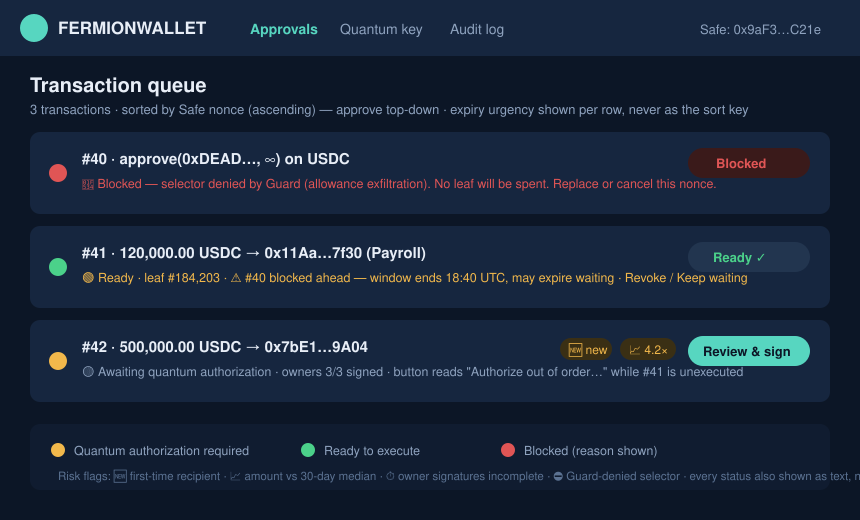

Every pending Safe transaction gets a traffic light:

| Status | Meaning | What to do |
|---|---|---|
| 🟡 **Quantum authorization required** | Owners have signed; no quantum pre-approval yet | Quantum Administrator: review and sign |
| 🟢 **Ready to execute** | A valid, unexpired pre-approval matches this exact transaction | Anyone: execute in Safe{Wallet} |
| ⛓️ **Blocked by earlier nonce** | Approved, but a lower-nonce transaction is still pending | Clear the earlier nonce first — its validity clock is already running |
| 🔴 **Blocked** | Expired, revoked, consumed, policy-violating, or Guard-denied | Read the reason; re-queue or fix |

Rows also carry **risk flags** computed automatically: 🆕 first-time recipient, 📈 amount well above the Safe's 30-day median, ⏱️ owner signatures still incomplete, ⛔ selector the Guard will reject no matter what (e.g. `approve` — shown so the Administrator never wastes a signature on a doomed transaction).

**The queue is sorted by Safe nonce — approve top-down.** Your Safe executes transactions in strict nonce order, so an approval granted out of order just sits behind the earlier nonces while its validity window burns; if it expires waiting, the signature is wasted (one leaf gone) and the whole review happens again. The app only offers **Authorize** on the lowest unapproved nonce and suggests a validity window long enough for everything ahead of it to clear. Ties (rows sharing a nonce — i.e., competing replacement candidates) sort by proposal timestamp, oldest first, with a **conflicts with row above** badge; there is no random reordering.

**When an earlier nonce is rejected or replaced**, the app immediately re-evaluates every later approved row: each 🟢/⛓️ row whose remaining validity window is now shorter than the estimated time for the queue ahead of it to clear gains an inline amber warning — *"Nonce #42 still pending, est. ~2 h to clear; your window ends in 1.5 h. This approval will likely expire unexecuted."* — with two actions: **Revoke now** (recover cleanly, then re-approve with a realistic window once the queue settles) or **Keep waiting** (logged). Expiry is never silent.

**After execution**, the row shows ✅ **Executed** with the execution tx hash for 24 hours, then moves to the **History** tab (backed by the [audit log](#audit-log-and-export)) — the live queue shows only actionable rows. A transaction that executed but whose target call failed on-chain shows ✅⚠️ **Executed — inner call reverted** instead, because the pre-approval is consumed either way and a retry needs a fresh approval.

**Revoking an approval you regret.** Every 🟢 row offers **Revoke approval** to the Administrator (and, per policy, to any owner). Typical use: you approved with a 48-hour window and realize 2 hours was right, or circumstances changed. Revocation is an on-chain `revokePreApproval` call submitted by the relayer, costs no leaf beyond the one already spent, flips the row to 🔴 **Revoked** with your identity and required reason in the audit log, and notifies all owners. The spent leaf is not recoverable — revoke is damage control, not an undo.

**Skipping ahead (the nonce override).** On any higher-nonce row the button reads **Authorize out of order…** and opens a full-screen modal — not a checkbox — that states the cost in concrete terms before letting you proceed:

> *"Nonce #42 is still unapproved. This approval cannot execute until #42 clears. If #42 takes longer than your validity window (you chose 6 h; the queue ahead is estimated at 9 h), this approval expires unexecuted and **leaf #184,205 is burned**. Type the nonce number to confirm."*

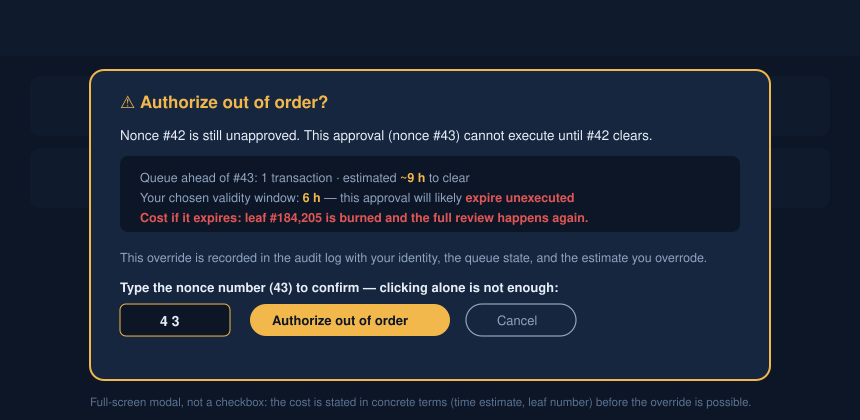

Typing the nonce (not just clicking OK) confirms; the override is written to the audit log with your identity, the queue state at that moment, and the estimate you overrode. If the skipped approval later expires, the audit entry is linked so the post-mortem writes itself.

## When an approved transaction is replaced

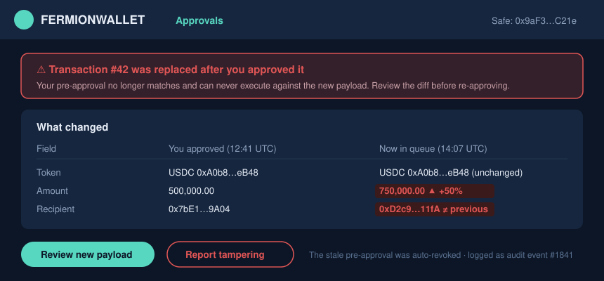

If anyone edits or replaces a Safe transaction after you approve it, the approval no longer matches — the row drops 🟢 → 🟡 automatically and the stale pre-approval is auto-revoked. You are never asked to spot the difference yourself:

- A red **"Transaction #N was replaced after you approved it"** banner appears on the row and in your notifications.
- **See changes** opens a field-by-field diff: what you approved (with timestamp) against what is now queued. Changed fields — amount, recipient, calldata hash — are highlighted in red with the delta stated plainly (`750,000.00 ▲ +50%`).
- Unchanged fields say so explicitly, so a benign gas-parameter replacement is recognizable in two seconds.
- Two actions: **Review new payload** (starts a fresh, normal approval — never a shortcut re-approve) and **Report tampering** (flags the event, notifies all owners).

A replacement is sometimes routine (fee bump) and sometimes an attack (recipient swap by a compromised proposer). The diff exists so you never re-approve a different transaction believing it is the same one.

## Approving a transfer (Quantum Administrator)

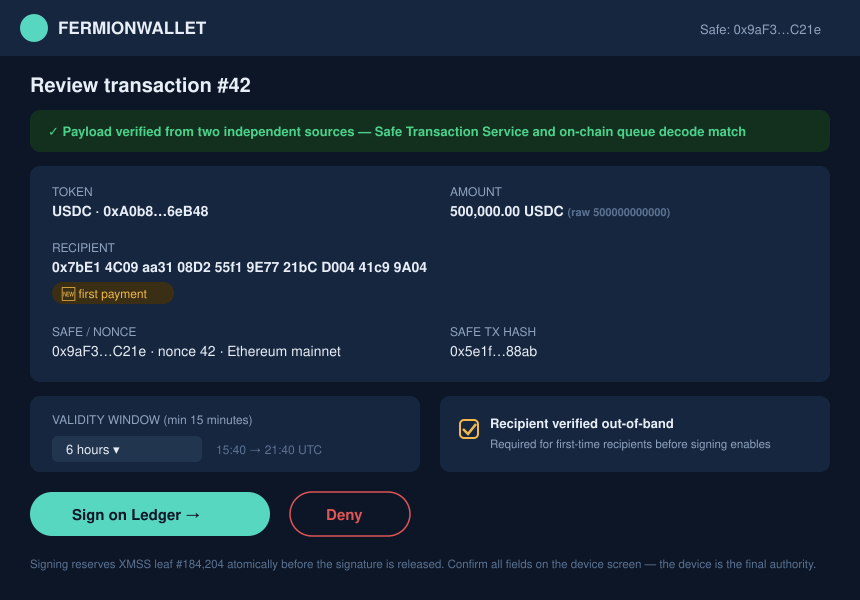

Opening a 🟡 row shows the full decoded payload. Before the **Sign on Ledger** button enables:

1. **Two-source check** (automatic): the payload from the Safe Transaction Service must byte-match a local decode of the on-chain queue. On success the screen shows *"✓ Payload verified from two independent sources."* On mismatch the flow **hard-stops with a full-screen, non-dismissable tamper screen**: red background, both payloads shown side by side with the differing bytes highlighted, *"The transaction service and the chain disagree about this transaction. Do not sign. All owners have been notified."* There is no retry, dismiss, or override on this screen — the only actions are **Notify owners again** and **Export evidence**; the row stays 🔴 until the discrepancy is resolved out-of-band. If the Safe Transaction Service is merely *unreachable* (timeout, not mismatch), the app says so explicitly and blocks signing until both sources respond — one source is not enough, availability failures fail closed.

   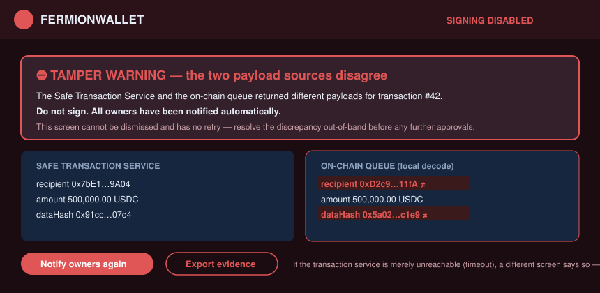
2. **Out-of-band verification** (manual, first-time recipients only): the checkbox carries its instructions inline — *"Call or message the requester on a channel other than the one that delivered this request (if it arrived by email, verify by phone — never reply to the request itself). Confirm the full recipient address, then tick."* Hovering **why?** explains the attack this defeats (a compromised request channel supplying both the transfer and its 'confirmation'). For recurring internal recipients (e.g. the payroll processor), a policy admin can mark an address **verified-recurring** after its first out-of-band check — subsequent transfers to it skip the checkbox and show `recipient on verified list` instead. There is no "I am the requester" self-attestation: if you requested it, have a second person verify — the checkbox records *who* ticked it either way.
3. **Pick the validity window**: how long the pre-approval stays executable (15-minute minimum, policy-bounded maximum). The app pre-fills a suggestion based on how many earlier nonces must execute first — accept it unless you know better. Too short and the approval expires in the queue (the leaf is spent either way, and everyone re-reviews); too long and a signed approval sits live longer than it needs to.

Then sign on the Ledger — see [What you see on the Ledger](#what-you-see-on-the-ledger).

**After the Ledger confirmation, the flow is not done — the approval must land on-chain.**

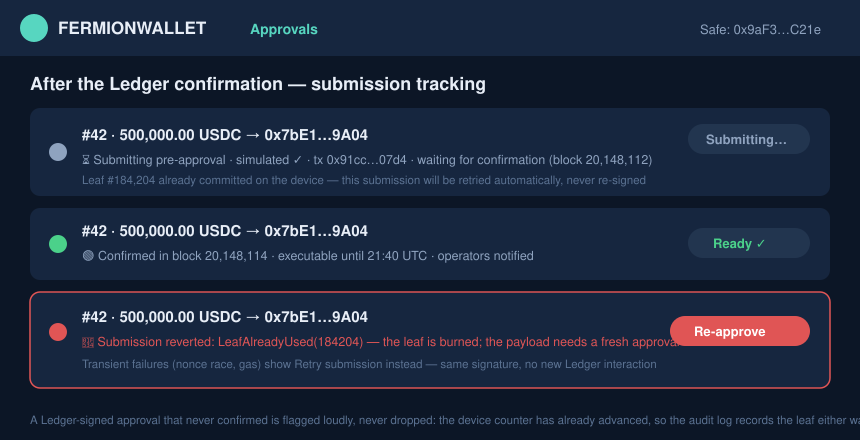

The row immediately shows ⏳ **Submitting…**: the app simulates `createPreApproval` via `eth_call`, then the relayer submits it, and the row shows the pending tx hash with a block-confirmation counter. Only after on-chain confirmation does the row flip to 🟢 and operators get notified. If the submission **reverts** (e.g. a `LeafAlreadyUsed` race, an expired registration, or a full commitment queue), the row flips to 🔴 with the decoded revert reason and one action — **Retry submission** where the failure was transient (the signature is reused; no new Ledger interaction or leaf) or **Re-approve** where the signed payload itself can no longer be valid. A Ledger-signed approval that never confirmed on-chain is prominently flagged, never silently dropped: the leaf counter on the device has already advanced, so the audit log records the burned leaf either way.

**Important:** if anyone edits or replaces the Safe transaction after you approve, the approval no longer matches and the row drops back to 🟡 automatically — see [When an approved transaction is replaced](#when-an-approved-transaction-is-replaced). Approvals bind to exact payloads, never to intents.

## Approving a batch (MultiSend)

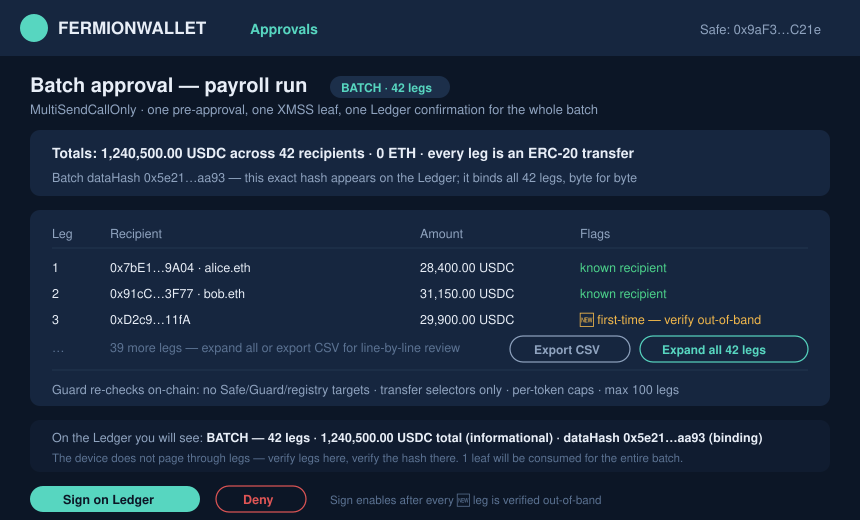

A genuine batch (payroll, vendor run) is **one transaction, one pre-approval, one XMSS leaf, one Ledger confirmation** — regardless of leg count (up to the on-chain cap of 100 legs).

- The queue row carries a **BATCH · n legs** badge and shows per-token totals instead of a single amount.
- The approval screen decodes **every leg** into a table: recipient, amount, risk flags per leg. Three legs show by default; **Expand all** or **export CSV** for line-by-line review. Every 🆕 first-time recipient leg must pass out-of-band verification before Sign enables — verifying the batch means verifying its new recipients, not skimming totals.
- **The Ledger does not page through legs.** The device shows `BATCH — 42 legs`, the per-token totals (informational), and the **batch dataHash** (binding). The division of labor is explicit on both screens: *verify legs in the app, verify the hash on the device* — the hash commits to every leg byte-for-byte, and the app displays the same hash so you can compare.

  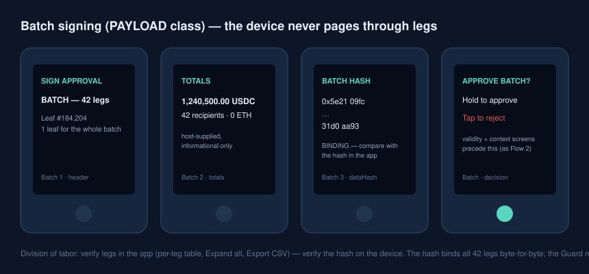
- The Guard independently re-decodes all legs on-chain (transfer selectors only, no Safe/Guard/registry targets, per-token caps), so even a lying host cannot smuggle a rogue leg under a correct-looking total.

If any leg would be rejected on-chain, the app blocks signing with the failing leg highlighted — never waste a leaf on a doomed batch.

## Denying a transfer

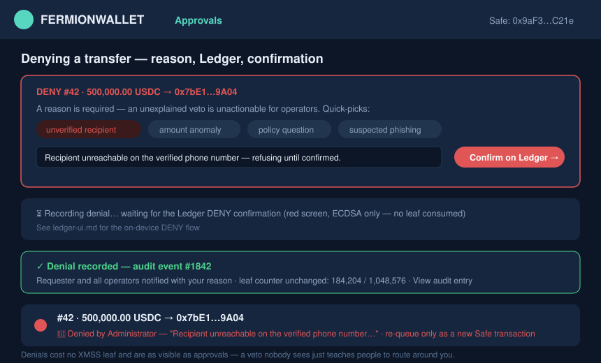
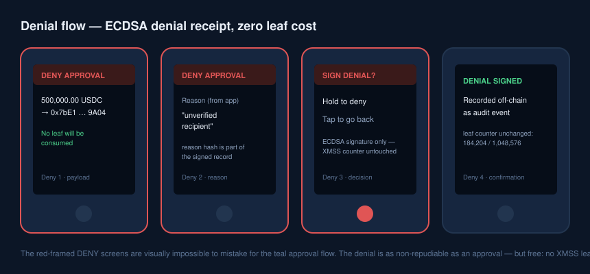

The **Deny** button records a Ledger-signed refusal — no quantum leaf is spent. The flow, end to end:

1. **Reason first.** Tapping Deny opens a required reason field (free text plus quick-picks: *unverified recipient*, *amount anomaly*, *policy question*, *suspected phishing*). You cannot deny silently — an unexplained veto is unactionable for operators.
2. **Ledger confirmation.** The device shows a visually distinct **DENY** screen (red header, same decoded payload, `No leaf will be consumed` stated on-screen) — tap to confirm. This is a standard ECDSA signature over the denial record, so the refusal is as non-repudiable as an approval, at zero leaf cost.
3. **Confirmation state.** The app shows *"Denial recorded — audit event #N"* with a link to the entry; the queue row flips to 🔴 **Denied by Administrator** with your reason visible to every owner and operator.
4. **Notification.** The requester and all operators are notified with the reason. A denied transaction can be re-queued only as a *new* Safe transaction — there is no "appeal" that reuses the old row.

Denials are deliberately as visible as approvals: a veto nobody sees just teaches people to route around you.

## The key ceremony (first-time setup and rotation)

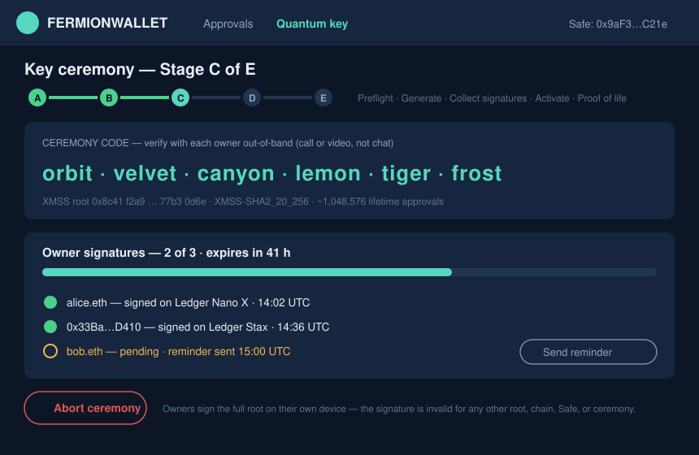
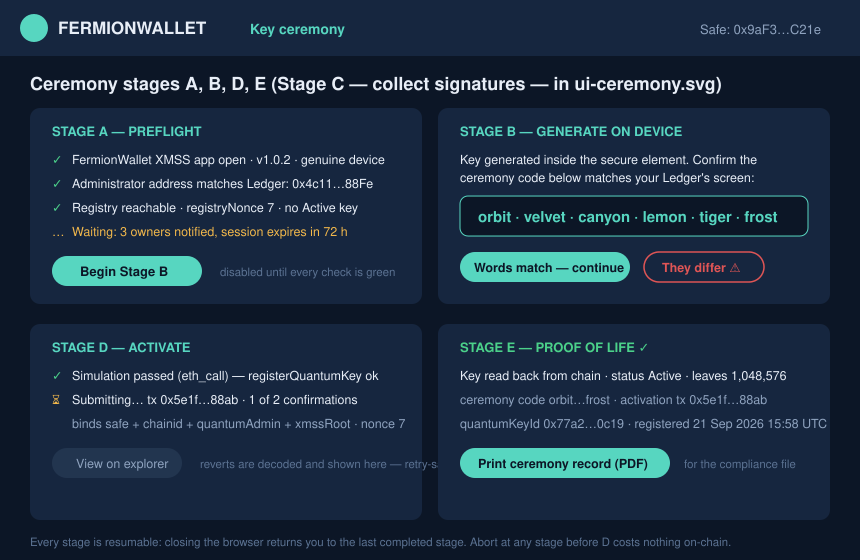
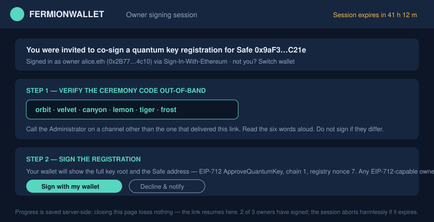

Run once at onboarding and again at each rotation. Five stages, one on-chain transaction, target under 10 minutes with owners online:

- **A — Preflight:** the app checks everything that could fail (right Ledger app, correct admin address, registry reachable) before anything is generated.
- **B — Generate:** the XMSS key is created inside the hardware; the app shows the **ceremony code** — six words like `orbit · velvet · canyon · lemon · tiger · frost` derived from the key's public root. Confirm they match the device display.
- **C — Collect signatures:** every Safe owner gets a link, sees the same six words, **verifies them with the Administrator out-of-band** (a call or video — not the same chat that delivered the link), and signs on their own hardware wallet. Their device shows the full key root: what they sign *is* the key, so no compromised website can swap it. The owner's screen shows the **session expiry countdown** (`expires in 41 h`) at the top — an owner who can't sign now knows exactly how long the link stays valid. A quorum tracker shows progress; the session expires after 72 h. Any owner can also **Abort ceremony** from this screen (one click + confirm) — aborting bumps the registry nonce on-chain so the session is provably dead, the right move if the words *don't* match. Closing the browser, a dead device battery, or a dropped connection lose nothing: the link re-opens to the same session at the same stage until expiry — signatures already collected stay collected.
- **D — Activate:** with the threshold reached, the Administrator submits the single registration transaction (simulated first).
- **E — Proof of life:** the app reads the key back from the chain and runs one test approval through the real on-chain verifier before declaring success. You get a printable ceremony record for the compliance file.

Every stage survives a disconnect or browser crash — reconnect and continue. An expired or aborted ceremony is harmless: restart from stage B; a fresh key costs nothing.

## Administrative approvals and the timelock

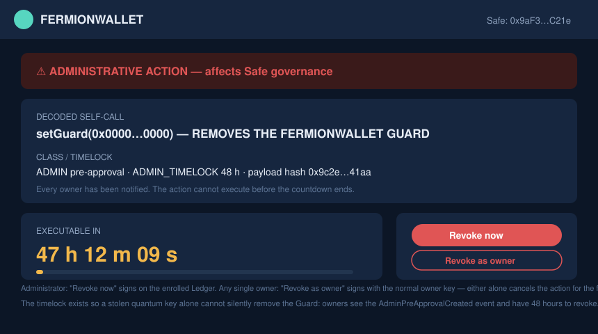

Non-transfer actions — removing or replacing the Guard, changing modules, owners, or thresholds, and native ETH sends — use separate pre-approval classes with **visually distinct treatment**: a red banner, the decoded action in plain language, and (for admin actions) a **mandatory timelock countdown**, typically 48 hours.

During the countdown:
- every owner is notified the moment the admin approval is created,
- the action cannot execute, full stop,
- anyone with standing — the Administrator or the owners — can revoke.

**Who sees what.** The Administrator and every owner see the *same* countdown screen; the only difference is the button. The Administrator's **Revoke now** signs on the enrolled Ledger. Each owner sees **Revoke as owner** and signs with their normal owner key — any *single* owner can revoke an admin approval during its delay (revocation is deliberately cheaper than approval; a false alarm costs one re-run of the timelock, a missed alarm costs the Safe).

**Revoking is one click plus one confirmation.** The confirm dialog states what you are cancelling and what happens next: *"This cancels the pending Guard removal. If it was legitimate, it must be re-created and the 48 h clock restarts. Revocations are logged and every owner is notified."* After confirming: the countdown card flips to a grey **Revoked** state showing who revoked, when, and from which role; the audit log gets the entry; all parties are notified. The revoked approval is dead on-chain — it cannot be un-revoked.

This is the anti-theft design: even a stolen quantum key cannot silently remove the Guard, because the removal is loud and slow while revocation is quiet and fast.

## Emergency Guard removal (owners only)

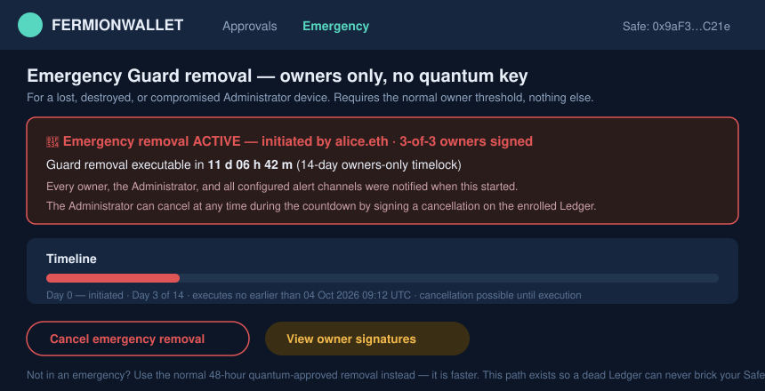

For when the quantum key **cannot** participate: the Ledger is lost or destroyed, the Administrator is unreachable, or the key is presumed compromised. This path needs **no quantum signature at all** — only your normal owner threshold — and takes 14 days.

**Where to find it.** The dashboard always shows a quiet footer link: *"Quantum key lost or compromised? → Emergency options."* If the enrolled key hasn't signed anything for 30 days, the link is promoted to a visible amber card so owners discover the exit before they need it.

**The flow:**
1. Any owner opens **Emergency options → Start emergency Guard removal**. The screen states the terms up front: 14-day timelock, every party notified immediately, the Administrator can cancel from the enrolled Ledger at any point during the countdown.
2. Owners sign the initiation with their normal keys (threshold required) — this is an ordinary Safe-governance action, deliberately independent of the quantum layer *and* of the FermionWallet backend.
3. The countdown card (shown above) is pinned to every owner's dashboard for the full 14 days: initiator, signatures, execute-no-earlier-than timestamp, and a **Cancel** path.
4. After 14 days, any owner executes the removal. The Safe is back to plain multisig — the app shows an unambiguous **UNPROTECTED** banner until a new key ceremony re-enables the Guard.

**Why 14 days:** long enough for a traveling, hospitalized, or merely offline Administrator to notice and cancel a hostile attempt (a stolen owner-threshold cannot beat the clock quietly); short enough that a dead Ledger never bricks the Safe. If the Administrator is available, don't use this path — the normal quantum-approved removal is 48 hours.

## What you see on the Ledger

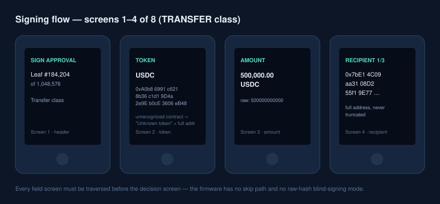
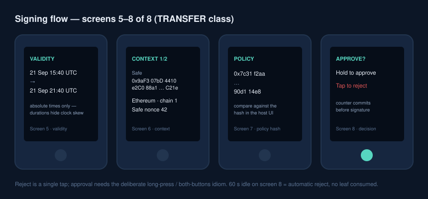

The device screen is the final authority — what you confirm there is exactly what the on-chain Guard enforces. The complete illustrated device reference (all flows: signing, **deny**, key generation, rotation, ambient/error screens) is [`ledger-ui.md`](./ledger-ui.md). During signing you page through:

1. **Header** — flow name and leaf number (`Sign approval — leaf #184,204 of 1,048,576`). The leaf counter is your odometer: an unexpected jump means the host tried to burn signatures.
2. **Token** — symbol, or "Unknown token" plus the full contract address.
3. **Amount** — decimals-adjusted, with the raw value on a details page.
4. **Recipient** — the full address, chunked across pages, never truncated.
5. **Validity** — absolute UTC times, not durations.
6. **Context** — Safe address, chain, nonce.
7. **Policy hash** — short fingerprint.
8. **Decision** — hold to approve, tap to reject. Rejecting or walking away costs nothing; no leaf is consumed until you approve.

Administrative payloads show a warning header (`ADMIN ACTION — affects Safe governance`) and the decoded intent, e.g. *"Removes the FermionWallet Guard"*. The approval class is inside the signed payload — a compromised computer cannot dress an admin action up as a transfer.

## Key health

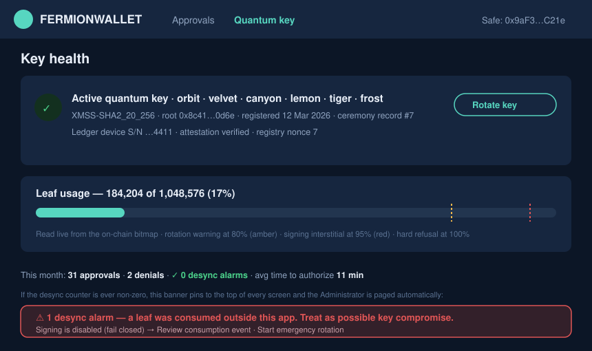

The Quantum key tab shows the active key at a glance: ceremony words, parameter set, registration date, and the **leaf usage bar** read live from the on-chain bitmap. Warnings fire at 80% (amber), 95% (interstitial before every signature), and 100% (signing refused — rotate).

**Desync alarms** live in the monthly stats line (`0 desync alarms` — green when zero). A desync means the chain shows a consumed leaf that this app never released: a potential key-compromise indicator. When the counter is non-zero, it does not stay quiet in a stats line — a **red banner pins to the top of every screen** (*"⚠ 1 desync alarm — a leaf was consumed outside this app. Treat as possible key compromise → review / start emergency rotation"*), signing is paused (fail-closed), and the Administrator is paged on **every configured alert channel simultaneously** (push, email, Slack/webhook — configured under *Settings → Notifications*; the pager route must include at least one channel that does not depend on the FermionWallet backend). The banner links to the exact on-chain event and to the [emergency rotation procedure](./quantum-key-registry.md#key-rotation-procedure-quantum-administrator).

**Rotate key** re-runs the ceremony with one extra proof from the old key. Plan rotation well before exhaustion — at typical treasury volume a 2^20 key lasts decades, so exhaustion warnings usually indicate abuse, not usage.

## Audit log and export

The **Audit log** tab (top navigation) is the append-only record of everything with a signature or a decision behind it: approvals (with leaf index and safeTxHash), denials (with reasons), nonce-order overrides, revocations, replaced-transaction events, ceremony records, emergency-path initiations and cancellations, and desync alarms. Executed-approval entries also record **which lookup tier matched on-chain** — `pinned (safeTxHash)` or `field-matched (queue position N)` — so an auditor can distinguish an exact-transaction approval from a recurring-payment match without reading the contract events.

- **Filters:** date range, event type, actor (Administrator / specific owner / system), Safe transaction, and status.
- **Export** (button, top right of the tab): **CSV** for spreadsheets, **JSON** for programmatic ingestion, and **signed PDF** for the compliance file — the PDF embeds each event's on-chain transaction hash and the ceremony records, so an auditor can independently verify every line against the chain.
- **Retention:** nothing is ever deleted or editable in the app's log; on-chain events are permanent by nature, and off-chain records (denials, reasons, overrides) follow your organization's configured retention floor (default: retained indefinitely, 7-year minimum recommended for treasuries).
- The export includes denials and overrides by default — the uncomfortable rows are the audit-relevant ones.

## Troubleshooting

| Symptom | Cause | Fix |
|---|---|---|
| "Wrong app open" at preflight | Ledger is on the dashboard or another app | Open the FermionWallet XMSS app |
| "Address mismatch" | Connected Ledger isn't the registered Quantum Administrator device | Use the enrolled device; the admin address is fixed at enrollment |
| Sign button stays disabled | Two-source check failed, or 🆕 recipient not confirmed | If sources disagree: stop, report — possible tampering. Otherwise tick the out-of-band checkbox |
| Row flipped 🟢 → 🟡 by itself | The Safe transaction was edited/replaced after approval | Open **See changes** for the field-by-field diff — re-approve only after reviewing it as a new transaction |
| `LeafAlreadyUsed` on submit | Service/chain desync (crash recovery) | Safe by design — the app skips forward automatically; if it recurs, contact support: it should never happen twice |
| Ceremony expired at 2-of-3 signatures | 72 h elapsed | Restart from stage B — new key, new words; old signatures are provably unusable |
| "Rotation overdue" interstitial | Key past 95% of its leaf budget | Run Rotate key now; signing stops entirely at 100% |
| Row shows ⛓️ blocked by earlier nonce | A lower-nonce Safe transaction hasn't executed | Execute (or reject/replace) the earlier nonce; approvals only run in nonce order |
| Approval expired before execution | Validity window shorter than the queue ahead of it (or network congestion) | Re-approve with the suggested window; each expiry costs one XMSS leaf, so fix the window rather than retrying blind |
| Simulation shows `FermionApprovalMissing` in Safe{Wallet} | Executing before quantum authorization | Wait for 🟢 — this error is the system working as intended |
